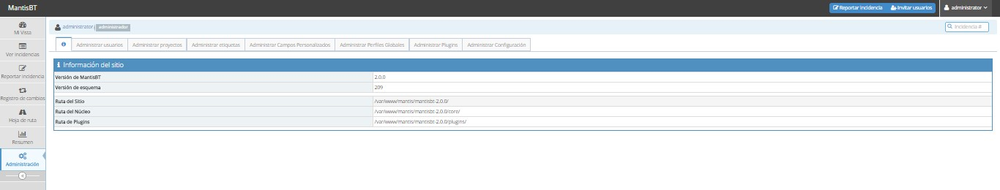

# Mantis-Bug-Tracker (Sistema de Gestión de Incidencias )
## Guía Básica de Herramienta Mantis Bug Tracker

Mantis Bug Tracker es una aplicación OpenSource realizada con php y mysql que destaca por su facilidad y flexibilidad de instalar y configurar. Esta aplicación se utiliza para testear soluciones, hacer un registro histórico de alteraciones y gestionar equipos remotamente.

Esta aplicación permite la creación de diversas cuentas de usuario desde las cuales se puede informar de los bugs detectados. Se puede dividir un proyecto en varias categorías, lo cual permite hacer un seguimiento más exacto de éste. El flujo de trabajo también se puede configurar desde la propia herramienta, de forma que puede definirse quién puede causar problemas, quién puede analizarlos y quién puede atenderlos.

### Las finalidades de esta aplicación son las siguientes:

- Agilizar el proceso de atención al cliente en las áreas de servicios informáticos, redes y cableado telefónico.

- Permitir tener un mayor control sobre el tiempo que los técnicos abarcan en una orden de servicio.

- Optimizar el tiempo de los técnicos, permitiéndoles observar sus tareas desde cualquier lugar.

- Proporcionar al usuario la facilidad de observar en qué etapa del proceso se encuentra el servicio solicitado.

- Disminuir las entradas de solicitudes por línea telefónica.

- Obtener de manera rápida información de donde se emplea el tiempo por parte del personal de soporte

- Obtener estadísticas de empleo de tiempo y de estado del servicio
 

Los requisitos son muy modestos y  permite la carga de plugins programados que añaden ciertas funcionalidades extra.

### Requisitos mínimos:

- MySQL 4.1x
- PHP 5.1.2
- Servidor web Apache 1.3.x
- Instalación y configuración aplicación

La instalación es muy sencilla. Descargas el paquete desde la web oficial (es un .zip) y lo descomprimes en tu servidor, en /var/www/tusitio.

Le asignas el usuario y el grupo www-data y le das los permisos de lectura, escritura y ejecución.

Insertas la dirección de tu sitio en el navegador y comenzamos la instalación paso a paso.

Primero realiza un chequeo de versiones, y demás.

Si está todo correcto, configuramos los parámetros básicos de la base de datos.

Seguidamente nos sale el mensaje de instalación correcta.

La primera vez, tienes que entrar con la cuenta admin por defecto. (Usuario: Administrator Password: root). Una vez dentro, puedes cambiar esos valores.

La interfaz de la aplicación es muy intuitiva, aunque muy completa. Solo señalaré algunas pestañas que me han parecido muy interesantes

Se pueden agregar usuarios nuevos y asignarle, entre otros valores, su nivel de acceso.

Permite crear proyectos, y configurar su estado  (abierto, encaminado, testeado, devuelto, cerrado, reabierto…)

Puedes asignar permisos a los usuarios, dependiendo de su nivel de acceso.

En esta pestaña se pueden reportar las incidencias, e incluso subir archivos a la nube.

En esa pestaña, se podrá ver un detallado resumen sobre las incidencias, tales, como el tiempo dedicado, o usuarios más eficaces, incluso, estadísticas.

En resumen, Mantis Bug Tracker es un gestor de incidencias muy completo, gratuito y muy intuitivo. Muy recomendable para un equipo de trabajo.
